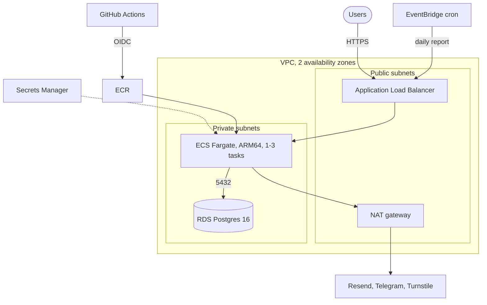

# serwis-infra

[](https://github.com/faceitall123qwe-hub/serwis-infra/actions/workflows/terraform.yml)

Terraform for running [serwis](https://github.com/faceitall123qwe-hub/serwis) (Next.js +
Postgres) on AWS. The live demo of serwis runs on Vercel; this is how I'd run it on AWS. It's
validated and linted in CI but I haven't applied it, so treat it as a reviewed design rather
than something battle-tested.



## Layout

```
bootstrap/            S3 bucket for remote state
modules/network/      VPC, public and private subnets, NAT, flow logs for rejected traffic
modules/database/     RDS Postgres, parameter group with forced SSL
modules/app/          ECR, ECS cluster and service, ALB, secrets, cron, autoscaling
modules/github-oidc/  role that GitHub Actions assumes to deploy
envs/prod/            wires the modules together, plus alarms and a cost budget
```

## Decisions

- **Fargate, not EC2 or App Runner.** No servers to patch, and it keeps the ALB and VPC setup
  under my control, which App Runner doesn't.
- **App and database in private subnets, one NAT gateway.** Nothing but the load balancer
  has a public IP. A NAT per zone would cost about $32/month more; for a one-person business
  I accept that outbound traffic depends on one zone.
- **Database password managed by RDS** (`manage_master_user_password`). It's generated and
  rotated in Secrets Manager and never appears in Terraform state.
- **App secrets are created empty.** Terraform creates the secret and the IAM permission to
  read it; I fill in the values with the AWS CLI, so API keys don't end up in state either.
- **Minimal IAM.** The task execution role can read exactly two secrets. The app doesn't call
  AWS at all, so its task role has no permissions.
- **Deploys from CI, not from Terraform.** The ECS service ignores task definition changes,
  so `terraform apply` won't roll back a deploy that GitHub Actions made.
- **No AWS keys in GitHub.** Actions gets short-lived credentials through OIDC, and only for
  the `main` branch of the app repo.
- **State locking without DynamoDB.** Terraform 1.10+ can lock directly in S3.
- **ARM tasks.** About 20% cheaper on Fargate than x86 for the same CPU.

## Usage

```bash
# once: bucket for state
cd bootstrap && terraform init && terraform apply

cd ../envs/prod
cp backend.hcl.example backend.hcl            # bucket name from the step above
cp terraform.tfvars.example terraform.tfvars
terraform init -backend-config=backend.hcl
terraform plan

# after apply, put the app's secrets in (JSON with DATABASE_URL, SESSION_SECRET, ...)
aws secretsmanager put-secret-value \
  --secret-id "$(terraform output -raw app_secret_arn)" \
  --secret-string file://app-secret.json
```

Then set `AWS_DEPLOY_ROLE_ARN` as a repository variable in serwis and run its `deploy-aws`
workflow.

## Cost

Roughly $80/month in eu-central-1 with one task and a single-zone database: load balancer
~$20, NAT ~$35, Fargate ~$8, RDS t4g.micro ~$15, plus logs and secrets. The budget alarm is
set to that number.

## CI

`terraform fmt -check`, `terraform validate`, tflint with the AWS rules, and Checkov
(reported, not blocking).

## License

MIT
