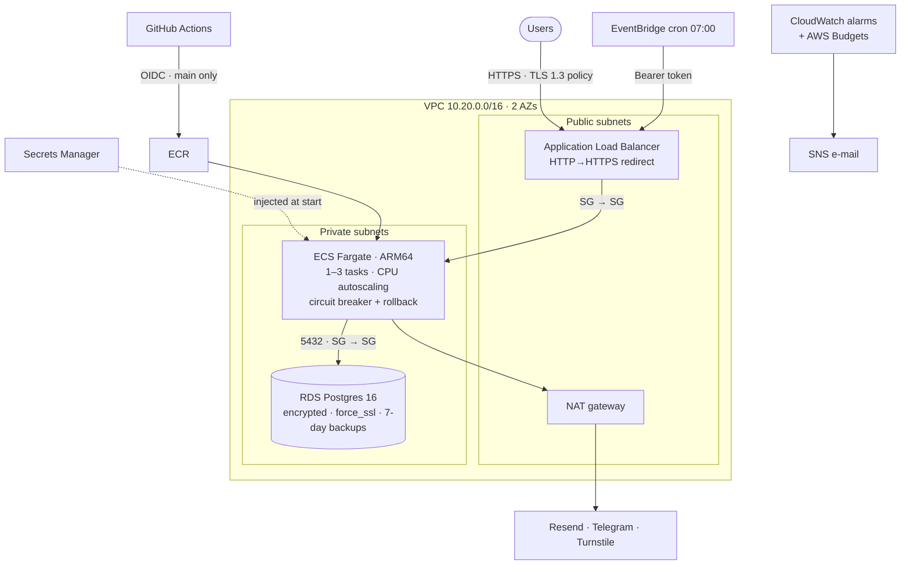

<div align="center">

# serwis-infra

**Production AWS infrastructure for [serwis](https://github.com/faceitall123qwe-hub/serwis) (Next.js 16 + Postgres), as Terraform modules.**

[](https://github.com/faceitall123qwe-hub/serwis-infra/actions/workflows/terraform.yml)


</div>

---

## Architecture



## Layout

```
bootstrap/              S3 state bucket (versioned, KMS, TLS-only, public access blocked)
modules/network/        VPC, 2 AZ public/private subnets, IGW, NAT, REJECT flow logs
modules/database/       RDS Postgres, parameter group (force_ssl), SG from app only
modules/app/            ECR, ECS cluster/service/task, ALB, Secrets Manager, cron, autoscaling
modules/github-oidc/    OIDC provider + least-privilege deploy role
envs/prod/              composition, alarms, budget
```

## Design decisions

| Decision | Why |
|---|---|
| Fargate over EC2 / App Runner | No hosts to patch; App Runner lacks VPC-private RDS ergonomics and fine-grained ALB control |
| Tasks in private subnets, single NAT | DB and tasks have no public IPs. One NAT instead of one per AZ saves ~$32/mo; egress is a single-AZ dependency, accepted for a one-person business |
| `manage_master_user_password` | RDS generates and rotates the master password in Secrets Manager; it never touches TF state |
| App secret created empty | Terraform owns the secret's ARN and IAM, values are written out-of-band so API keys stay out of state |
| Execution role scoped to two secret ARNs, task role empty | The app calls no AWS APIs; least privilege by default |
| `ignore_changes = [task_definition]` | CI owns image rollouts; `terraform apply` won't roll back a deploy |
| OIDC deploy role pinned to `repo:…:ref:refs/heads/main` | No long-lived AWS keys in GitHub; feature branches can't deploy |
| Native S3 state locking (`use_lockfile`) | Terraform ≥ 1.10 doesn't need a DynamoDB lock table |
| ARM64 tasks | ~20% cheaper per vCPU than x86 on Fargate |

## Usage

```bash
# 1. state bucket (once)
cd bootstrap && terraform init && terraform apply

# 2. environment
cd ../envs/prod
cp backend.hcl.example backend.hcl              # bucket name from step 1
cp terraform.tfvars.example terraform.tfvars
terraform init -backend-config=backend.hcl
terraform plan

# 3. after apply: app secrets (JSON with DATABASE_URL, SESSION_SECRET, ...)
aws secretsmanager put-secret-value \
  --secret-id "$(terraform output -raw app_secret_arn)" \
  --secret-string file://app-secret.json

# 4. set the repo variable AWS_DEPLOY_ROLE_ARN in serwis and run its deploy-aws workflow
```

Rough monthly cost (eu-central-1, 1 task, single-AZ RDS): ALB ~$20, NAT ~$35,
Fargate 0.25 vCPU/0.5 GB ARM ~$8, RDS t4g.micro ~$15, plus logs/secrets — about **$80**,
which is what the budget alarm defaults to.

## CI

`.github/workflows/terraform.yml`: `fmt -check`, `validate` (no backend), `tflint` with the
AWS ruleset, and Checkov (soft-fail) on every push and PR.

> This stack has been validated and linted but not applied: the live demo runs on Vercel.
